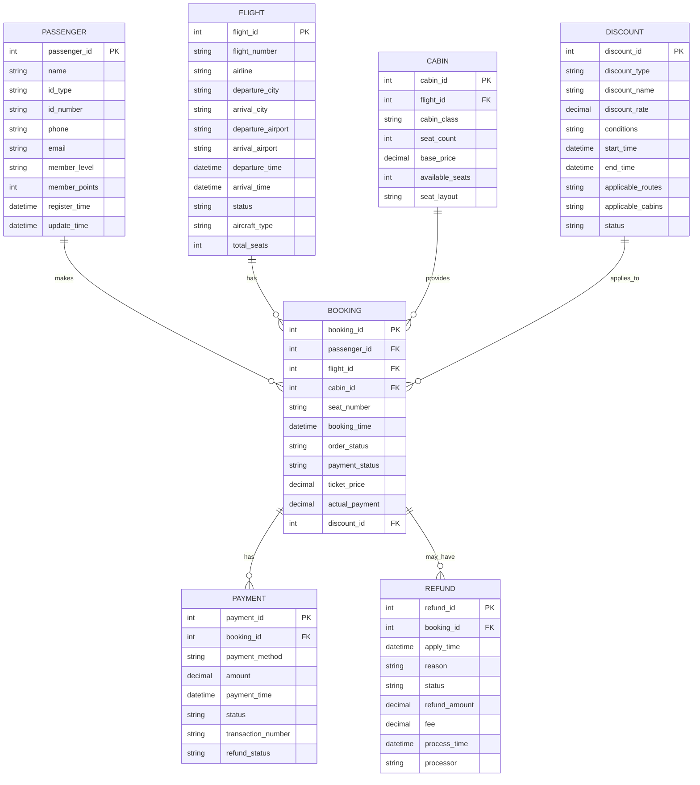

# 航空机票预订系统数据库设计文档

## 1. 业务流程分析

### 1.1 机票预订流程
1. 旅客注册/登录系统
2. 搜索航班信息（单程/往返/多程）
3. 选择航班和舱位
4. 填写乘机人信息
5. 选择附加服务
6. 系统计算票价（含折扣）
7. 确认订单并支付
8. 出票完成

### 1.2 机票销售流程
1. 销售人员登录系统
2. 查询航班信息
3. 录入旅客信息
4. 选择舱位和价格
5. 应用相应折扣
6. 确认订单信息
7. 处理支付
8. 完成出票

### 1.3 机票打折流程
1. 管理员设置折扣策略
   - 季节性折扣
   - 特定航线折扣
   - 会员等级折扣
   - 促销活动折扣
2. 系统自动计算适用折扣
3. 生成最终票价

### 1.4 退票流程
1. 旅客申请退票
2. 系统检查退票条件
3. 计算退票费用
4. 确认退票申请
5. 处理退款
6. 更新座位状态
7. 完成退票手续

## 2. 实体分析

### 2.1 主要实体及属性

#### 2.1.1 旅客信息（Passenger）
- 旅客ID（主键）
- 姓名
- 证件类型
- 证件号码
- 联系电话
- 电子邮箱
- 会员等级
- 会员积分
- 注册时间
- 最后更新时间

#### 2.1.2 航班信息（Flight）
- 航班ID（主键）
- 航班号
- 航空公司
- 出发城市
- 到达城市
- 出发机场
- 到达机场
- 计划起飞时间
- 计划到达时间
- 航班状态
- 机型
- 总座位数

#### 2.1.3 舱位信息（Cabin）
- 舱位ID（主键）
- 航班ID（外键）
- 舱位等级
- 座位数量
- 基础价格
- 剩余座位数
- 座位布局

#### 2.1.4 折扣信息（Discount）
- 折扣ID（主键）
- 折扣类型
- 折扣名称
- 折扣率
- 使用条件
- 开始时间
- 结束时间
- 适用航线
- 适用舱位
- 状态

#### 2.1.5 订票信息（Booking）
- 订单ID（主键）
- 旅客ID（外键）
- 航班ID（外键）
- 舱位ID（外键）
- 座位号
- 订票时间
- 订单状态
- 支付状态
- 票价
- 实付金额
- 使用折扣

#### 2.1.6 退票信息（Refund）
- 退票ID（主键）
- 订单ID（外键）
- 申请时间
- 退票原因
- 退票状态
- 退款金额
- 手续费
- 处理时间
- 处理人

#### 2.1.7 支付信息（Payment）
- 支付ID（主键）
- 订单ID（外键）
- 支付方式
- 支付金额
- 支付时间
- 支付状态
- 交易流水号
- 退款状态

## 3. E-R图设计



## 4. 数据库逻辑结构设计

### 4.1 表结构设计

#### 4.1.1 旅客信息表（t_passenger）
```sql
CREATE TABLE t_passenger (
    passenger_id BIGINT PRIMARY KEY AUTO_INCREMENT,
    name VARCHAR(50) NOT NULL,
    id_type VARCHAR(20) NOT NULL,
    id_number VARCHAR(50) NOT NULL,
    phone VARCHAR(20) NOT NULL,
    email VARCHAR(100),
    member_level VARCHAR(20) DEFAULT 'NORMAL',
    member_points INT DEFAULT 0,
    register_time DATETIME NOT NULL,
    update_time DATETIME NOT NULL,
    UNIQUE KEY uk_id_number (id_type, id_number),
    KEY idx_phone (phone),
    KEY idx_email (email)
);
```

#### 4.1.2 航班信息表（t_flight）
```sql
CREATE TABLE t_flight (
    flight_id BIGINT PRIMARY KEY AUTO_INCREMENT,
    flight_number VARCHAR(20) NOT NULL,
    airline VARCHAR(50) NOT NULL,
    departure_city VARCHAR(50) NOT NULL,
    arrival_city VARCHAR(50) NOT NULL,
    departure_airport VARCHAR(100) NOT NULL,
    arrival_airport VARCHAR(100) NOT NULL,
    departure_time DATETIME NOT NULL,
    arrival_time DATETIME NOT NULL,
    status VARCHAR(20) NOT NULL,
    aircraft_type VARCHAR(50) NOT NULL,
    total_seats INT NOT NULL,
    UNIQUE KEY uk_flight_number (flight_number, departure_time),
    KEY idx_departure (departure_city, departure_time),
    KEY idx_arrival (arrival_city, arrival_time)
);
```

#### 4.1.3 舱位信息表（t_cabin）
```sql
CREATE TABLE t_cabin (
    cabin_id BIGINT PRIMARY KEY AUTO_INCREMENT,
    flight_id BIGINT NOT NULL,
    cabin_class VARCHAR(20) NOT NULL,
    seat_count INT NOT NULL,
    base_price DECIMAL(10,2) NOT NULL,
    available_seats INT NOT NULL,
    seat_layout TEXT,
    FOREIGN KEY (flight_id) REFERENCES t_flight(flight_id),
    UNIQUE KEY uk_flight_cabin (flight_id, cabin_class)
);
```

#### 4.1.4 折扣信息表（t_discount）
```sql
CREATE TABLE t_discount (
    discount_id BIGINT PRIMARY KEY AUTO_INCREMENT,
    discount_type VARCHAR(50) NOT NULL,
    discount_name VARCHAR(100) NOT NULL,
    discount_rate DECIMAL(4,2) NOT NULL,
    conditions TEXT,
    start_time DATETIME NOT NULL,
    end_time DATETIME NOT NULL,
    applicable_routes TEXT,
    applicable_cabins VARCHAR(100),
    status VARCHAR(20) NOT NULL,
    KEY idx_time_range (start_time, end_time),
    KEY idx_status (status)
);
```

#### 4.1.5 订票信息表（t_booking）
```sql
CREATE TABLE t_booking (
    booking_id BIGINT PRIMARY KEY AUTO_INCREMENT,
    passenger_id BIGINT NOT NULL,
    flight_id BIGINT NOT NULL,
    cabin_id BIGINT NOT NULL,
    seat_number VARCHAR(10),
    booking_time DATETIME NOT NULL,
    order_status VARCHAR(20) NOT NULL,
    payment_status VARCHAR(20) NOT NULL,
    ticket_price DECIMAL(10,2) NOT NULL,
    actual_payment DECIMAL(10,2) NOT NULL,
    discount_id BIGINT,
    FOREIGN KEY (passenger_id) REFERENCES t_passenger(passenger_id),
    FOREIGN KEY (flight_id) REFERENCES t_flight(flight_id),
    FOREIGN KEY (cabin_id) REFERENCES t_cabin(cabin_id),
    FOREIGN KEY (discount_id) REFERENCES t_discount(discount_id),
    KEY idx_booking_time (booking_time),
    KEY idx_status (order_status, payment_status)
);
```

#### 4.1.6 退票信息表（t_refund）
```sql
CREATE TABLE t_refund (
    refund_id BIGINT PRIMARY KEY AUTO_INCREMENT,
    booking_id BIGINT NOT NULL,
    apply_time DATETIME NOT NULL,
    reason TEXT,
    status VARCHAR(20) NOT NULL,
    refund_amount DECIMAL(10,2) NOT NULL,
    fee DECIMAL(10,2) NOT NULL,
    process_time DATETIME,
    processor VARCHAR(50),
    FOREIGN KEY (booking_id) REFERENCES t_booking(booking_id),
    KEY idx_apply_time (apply_time),
    KEY idx_status (status)
);
```

#### 4.1.7 支付信息表（t_payment）
```sql
CREATE TABLE t_payment (
    payment_id BIGINT PRIMARY KEY AUTO_INCREMENT,
    booking_id BIGINT NOT NULL,
    payment_method VARCHAR(50) NOT NULL,
    amount DECIMAL(10,2) NOT NULL,
    payment_time DATETIME NOT NULL,
    status VARCHAR(20) NOT NULL,
    transaction_number VARCHAR(100) NOT NULL,
    refund_status VARCHAR(20) DEFAULT 'NO_REFUND',
    FOREIGN KEY (booking_id) REFERENCES t_booking(booking_id),
    UNIQUE KEY uk_transaction (transaction_number),
    KEY idx_payment_time (payment_time),
    KEY idx_status (status, refund_status)
);
```

## 5. 数据库物理结构优化

### 5.1 索引优化
1. 对常用查询条件建立复合索引
2. 对外键关系建立索引
3. 对时间范围查询建立索引
4. 对状态字段建立索引

### 5.2 分区策略
1. 按时间范围对大表进行分区
   - 订单表按月分区
   - 支付记录表按月分区
   - 退票记录表按月分区

### 5.3 存储优化
1. 使用适当的字段类型和长度
2. 对大字段使用TEXT类型
3. 使用压缩表存储历史数据

### 5.4 性能优化
1. 配置合适的缓冲池大小
2. 优化查询语句
3. 使用读写分离
4. 实现分库分表

### 5.5 备份策略
1. 每日全量备份
2. 实时增量备份
3. 定期归档历史数据 